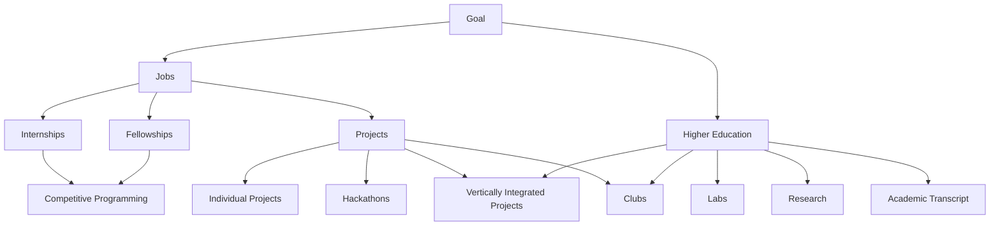

# Opportunities

Based on your goals out of college, you may want to pursue some different opportunities.

```mermaid
flowchart TD
    g[Goal] --> j[Jobs]
    g --> r[Higher Education]

    j --> internships[Internships]
    j --> fellowships[Fellowships]
    j --> p[Projects]
    p --> ip[Individual Projects]
    p --> hackathons[Hackathons]
    p --> vip[Vertically Integrated Projects]
    p --> clubs[Clubs]
    
    internships --> cp[Competitive Programming]
    fellowships --> cp

    r --> vip
    r --> clubs
    r --> labs[Labs]
    r --> research[Research]
    r --> gpa[Academic Transcript]

    click internships href "/docs/Opportunities/Internships"
    click fellowships href "/docs/Opportunities/Fellowships"
    click p href "/docs/Opportunities/projects"
    click hackathons href "/docs/Opportunities/Hackathons"
    click vip href "/docs/Opportunities/VIP"
    click clubs href "/docs/Opportunities/Internal/clubs"
    click labs href "/docs/Opportunities/Internal/labs"
    click research href "/docs/Opportunities/Internal/research"
    click cp href "/docs/Opportunities/Internships/competitive_programming"

```
